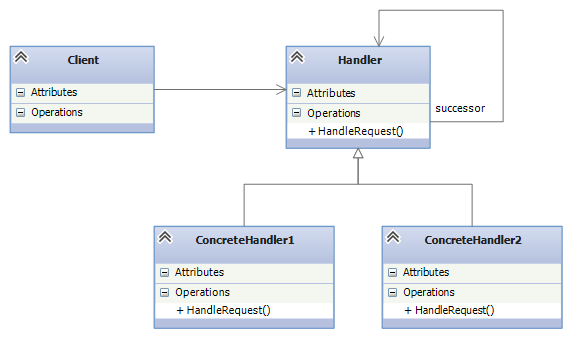

#责任链模式
链中的每一个节点看作是一个对象，每个节点处理的请求不同。 \
请求从链的首端，沿着链的路径依次传递至每一个节点对象，直至有节点处理该请求。

## 原理及应用场景
### 原理
责任链模式主要是解耦了请求与处理，客户端只需要将请求发送到链上即可，无需关心请求的具体内容和处理细节，请求会自动进行传递直至有节点对象进行处理。
### 应用场景
1. 多个对象可以处理同一请求，但具体由哪个对象处理则在运行时动态决定
2. 在不明确指定接收者的情况下，向多个对象中的一个提交一个请求
3. 可动态指定一组对象处理请求

## 优点
1. 降低了对象之间的耦合度：该模式降低了请求发送者和接收者的耦合度。
2. 增强了系统的可扩展性：可以根据需要增加新的请求处理类，满足开闭原则。
3. 增强了给对象指派职责的灵活性：当工作流程发生变化，可以动态地改变链内的成员或者修改它们的次序，也可动态地新增或者删除责任。
4. 责任链简化了对象之间的连接：一个对象只需保持一个指向其后继者的引用，不需保持其他所有处理者的引用，这避免了使用众多的 if 或者 if···else 语句。
5. 责任分担：每个类只需要处理自己该处理的工作，不能处理的传递给下一个对象完成，明确各类的责任范围，符合类的单一职责原则
## 缺点
1. 不能保证每个请求一定被处理。由于一个请求没有明确的接收者，所以不能保证它一定会被处理，该请求可能一直传到链的末端都得不到处理。
2. 对比较长的职责链，请求的处理可能涉及多个处理对象，系统性能将受到一定影响。
3. 职责链建立的合理性要靠客户端来保证，增加了客户端的复杂性，可能会由于职责链的错误设置而导致系统出错，如可能会造成循环调用。

## UML

## 角色类
### 抽象Handler
定义一个处理请求的接口，包含抽象处理方法和一个后继连接。
### 具体Handler
实现抽象处理者的处理方法，判断能否处理本次请求，如果可以处理请求则处理，否则将该请求转给它的后继者。
### 客户端Client
创建处理链，并向链头的具体处理者对象提交请求，它不关心处理细节和请求的传递过程。

